# SmartRouter Agent Token Economics 2026

## Public trajectory corpus, task-cost model, and telemetry handbook

Version 2A · Evidence cutoff 2026-07-18 · Europe/Berlin

This handbook is a research artifact for the independent SmartRouter project.
It is not an official OpenAI publication, and it does not claim OpenAI
endorsement. It proposes measurement and routing methods; it does not change the
SmartRouter production runtime.

## Executive Summary

The economically correct routing question is not “which model has the lowest
listed token price?” It is:

> Which available model is expected to produce an accepted result at the lowest
> total task-chain cost, subject to capability, risk, verification, budget,
> availability, and human-approval constraints?

Answering that question requires more than input and output token counts. A
complete record must link the task, route decision, attempts, model requests,
tools, context growth, retries, escalation, verification, acceptance, human
review, price basis, and censoring. No public source inspected in 2A supplies
that complete join.

The discovery protocol registered 78 deduplicated primary or official sources
(plus two retained source aliases) and 41 dataset,
benchmark, aggregate-result, framework, or telemetry-surface records. None
passed all gates for a numerical SmartRouter routing prior. This is not a failed
research outcome. It is the central finding: public agent artifacts are rich in
tasks, actions, patches, screenshots, and outcome labels, but sparse in
compatible provider-reported token accounting, complete failures, stable model
identity, dated cost components, and reusable publication rights.

The 2A corpus therefore does four things:

1. preserves an exhaustive **discovery protocol**, not a false claim of
   exhaustive historical telemetry;
2. defines strict, versioned run/request/task/provenance schemas that preserve
   `null` rather than inventing zero;
3. supplies reproducible registries, bounded parser evidence, missingness maps,
   robust analysis code, empty-safe baselines, and privacy-aware manifests;
4. specifies the local telemetry that mission 2B must collect before numerical
   model-selection rules can be calibrated.

The numerical gate remains closed. Spark, Luna, Terra, and Sol are not assigned
efficiency regions in this handbook because 2A has neither controlled matched
runs nor an independently verified alias-to-immutable-model mapping for those
labels. Version order, price alone, and model reputation are not evidence.

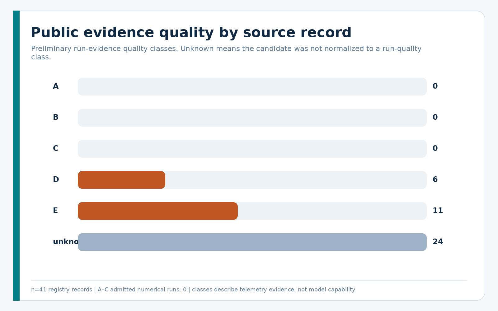

## 1. What Token Usage Actually Means

“Tokens used” can refer to several incompatible quantities. Combining them
without scope and provenance creates false comparisons.

### 1.1 Request accounting

- **Raw input tokens** are the provider/framework input count for one request.
  On many surfaces this includes the cached subset.
- **Non-cached input tokens** are input tokens not served from cache. They may be
  provider-reported or reconstructed only when compatible totals exist.
- **Cached input tokens** are input tokens read from a cache. They remain part
  of logical input/context processing.
- **Cache-write tokens** are tokens written to a cache when a model/version
  exposes this field.
- **Reasoning tokens** are a provider-reported output-side count. They are not
  hidden reasoning text.
- **Visible output tokens** require a surface that measures visible content or
  an explicitly labeled tokenizer reconstruction. Provider `output_tokens` can
  include reasoning and other non-visible structure.
- **Total reported tokens** preserve the source definition. The corpus does not
  force an arithmetic sum when field semantics differ.

The current [OpenAI prompt-caching documentation](https://developers.openai.com/api/docs/guides/prompt-caching)
separates cache reads and writes, while the [Agents SDK usage interface](https://github.com/openai/openai-agents-python/blob/65886fa16dcdb482090b30b74de1d0cc80b9f4c6/docs/usage.md)
preserves run totals and per-request entries. These are measurement surfaces,
not a public accepted-task dataset.

### 1.2 Session and context accounting

- **Cumulative session tokens** sum processing over time.
- **Current context occupancy** is what currently occupies the model context.
- **Context-window size** is capacity, not occupancy.
- **Tokens re-sent from history** are history serialized into later requests.
- **Tool-output tokens** are tool results introduced into later model input.
- **Compaction tokens** are summaries or other content introduced by a
  compaction step.

Cumulative usage can grow far beyond the context-window capacity because prior
content is processed repeatedly. A decreasing last-turn count does not prove a
compaction occurred, and a context-window field does not reveal occupancy.

### 1.3 Billing and product quotas

- **API-billed tokens** use API billing semantics for a particular model,
  service tier, region, and date.
- **Reported monetary cost** is a source-provided amount with a declared scope.
- **Reconstructed cost** is a calculation against an identified price table.
- **Subscription quota consumption** is product-plan accounting and is not
  inferred from API prices.
- **Rate-limit capacity** is neither usage cost nor subscription credit.

Current prices are referenced through the dated [official OpenAI pricing page](https://developers.openai.com/api/docs/pricing),
but 2A does not present current prices as a historical ledger. A current-price
reconstruction of an older run is counterfactual and must be labeled as such.

## 2. History of Public Agent Telemetry

Public agent evidence evolved faster than standardized token telemetry.

| Era | Typical public evidence | Token-economics value |
| --- | --- | --- |
| ReAct/tool-use, 2022–2023 | papers, prompt examples, action traces | historical/task-taxonomy context; no comparable usage corpus |
| autonomous agents, 2023 onward | framework code, examples, benchmark loops | architecture context; historical use generally unmeasured |
| web/computer use, 2023 onward | DOM/accessibility state, screenshots, browser actions, verifier outcomes | tool/context structure; substantial privacy risk; token fields usually absent |
| software agents, 2023 onward | issues, patches, trajectories, tests, leaderboard outcomes | strongest objective-verifier ecosystem; accounting and rights remain heterogeneous |
| multi-agent systems, 2023 onward | conversations, roles, aggregate examples | qualitative coordination amplification; no general response curve |
| long-horizon terminal agents, 2024 onward | container tasks, tool traces, deterministic tests | promising future strata when exact usage is collected |
| current Codex/Agents SDK | versioned usage and trace interfaces | strong local collection surfaces; not a universal public task corpus |

The [ReAct paper](https://arxiv.org/abs/2210.03629) formalized interleaved
reasoning and acting, but its artifacts do not provide standardized provider
usage records. [WebArena](https://github.com/web-arena-x/webarena) provides a
benchmark implementation and objective evaluation harness, but its code license
does not by itself establish redistribution rights for separately hosted trace
archives. [SWE-agent](https://github.com/SWE-agent/SWE-agent) and the
[SWE-bench experiments archive](https://github.com/SWE-bench/experiments)
illustrate how software trajectories can link to objective tests, but their
formats and cost fields vary by release/submission and do not provide one stable
per-request accounting contract.

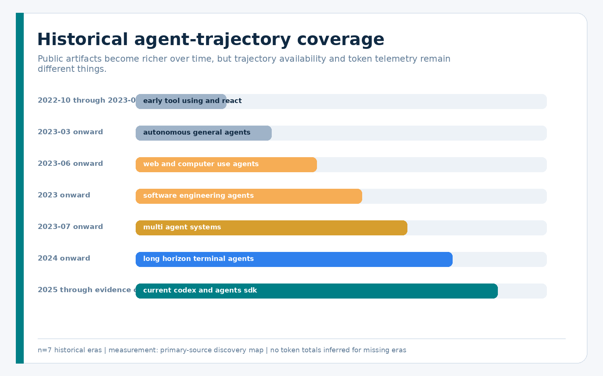

The timeline is a coverage map, not an inference of token use where measurements
are absent.

## 3. OpenAI Usage and Tracing Interfaces

### 3.1 Responses usage

The official Responses schema can expose input tokens, cached-input details,
model-dependent cache writes, output tokens, reasoning-token details, and a
reported total. Response items expose model/tool activity. It does not supply a
benchmark task ID, verifier result, retry chain, accepted result, or human-review
cost. Application-defined join keys remain necessary.

### 3.2 Organization usage and costs

Organization usage and cost endpoints provide time-bucketed audit aggregates.
They are useful for reconciliation, but a daily/bucketed amount cannot generally
be assigned to one agent task. They lack complete task identity, verifier result,
reasoning breakdown, and route-chain semantics. Their records are private
operator data even when the source schema has a permissive software license.

### 3.3 Agents SDK usage and tracing

The [OpenAI Agents SDK usage documentation](https://github.com/openai/openai-agents-python/blob/65886fa16dcdb482090b30b74de1d0cc80b9f4c6/docs/usage.md)
documents request count, run-level input/output/total usage, nested cached and
reasoning details, and `request_usage_entries`. Usage aggregates model calls
made during tool loops and handoffs. Traces add model, tool, handoff, guardrail,
and custom spans.

This is the strongest official run-level collection surface inspected, but it
still needs application-defined task, attempt, retry, escalation, verification,
acceptance, and privacy metadata. Third-party adapters can omit usage or apply
different defaults, so provider/backend behavior must be validated rather than
assumed.

### 3.4 Stable interfaces versus observations

The corpus labels each claim as one of:

- stable documented interface;
- official source-defined interface;
- local generated observation tied to Codex CLI 0.144.5;
- private/unstable artifact.

This prevents a field observed in a local schema or issue from being presented
as a permanent cross-version contract.

## 4. Codex-Specific Telemetry Surfaces

The documented `codex exec --json` stream provides typed lifecycle events. On
the inspected Codex version and current source, `turn.completed.usage` can expose
input, cached input, output, and reasoning-output counts; source-defined cache
write support is version-gated. Typed item lifecycle events can reconstruct
command, MCP, collaboration, web-search, message, and other activity without
counting raw transcript content. The [pinned Codex event source](https://github.com/openai/codex/blob/56395bddaf26eb2829387ca6a417bf9128e5b239/codex-rs/exec/src/exec_events.rs)
anchors the source-only fields.

Locally generated app-server schemas for Codex CLI 0.144.5 expose last and total
token breakdowns, model-context-window capacity, compaction events, and
account-rate-limit surfaces. These are version-specific. They do not prove
current context occupancy, API cost, subscription conversion, or task success.

Raw local rollout/session JSONL is explicitly rejected as a public corpus. It
can contain private prompts, responses, tool I/O, paths, secrets, and personal
data. Mission 2B should prefer allowlisted `exec --json` capture with ephemeral
mode where suitable, then join only the required counts and lifecycle metadata.

## 5. Public Agent Trajectory Datasets

### 5.1 Software-engineering agents

**SWE-bench Experiments.** The archive can link task IDs, predictions,
trajectories, and evaluator outcomes, and some SWE-agent submissions contain
aggregate cost/token fields. However, schemas vary by submission; per-request
breakdowns are often absent; failures and missing trajectories need inventory;
the repository and external submission rights are not a single reusable data
license; and complete payload size is unbounded. Decision: metadata/reference
only pending a human rights decision.

**SWE-agent demonstrations.** Nineteen small demonstration `.traj` files
(1,503,861 bytes) at the pinned repository revision form a bounded parser
fixture. All parsed as JSON and have unique SHA-256 values. Eighteen contain a
`model_stats` object, but every input/output token and cost value is zero despite
non-empty trajectories; three replay fixtures report 11, 11, and 13 API calls
with zero token counts. These are placeholders/replay metadata, not measured
zero-token runs. The fixtures are quality E, all outcomes remain unknown, and
all 19 contain explicit thought fields. Raw content is not republished;
structural field presence, hashes, sizes, and safe counts are retained.

**SWE-smith.** The task and trajectory releases are promising at scale, but the
asset card, failure selection, exact fields, model identity, and trajectory
rights must be audited independently of the repository license. Training-value
filters make raw success rates unsuitable for deployment priors.

**OpenHands.** The current framework and newer benchmark harness support rich
run logs and objective evaluators, but legacy and current event schemas cannot
be silently combined. Each public run release needs an independent license,
version, adapter, prompt, budget, condenser, and failure-coverage audit.

**Terminal-Bench and Harbor.** [Harbor](https://github.com/harbor-framework/harbor)
is an agent-evaluation framework, not a comparable public token corpus.
[Terminal-Bench 2](https://github.com/harbor-framework/terminal-bench-2)
provides objective terminal tasks. Both are strong candidates for future local
measurement, not current public token priors.

**STATE-Bench and AgentRE-Bench.** [STATE-Bench](https://github.com/microsoft/STATE-Bench)
documents stateful enterprise-workflow evaluation, while
[AgentRE-Bench](https://github.com/agentrebench/AgentRE-Bench) provides scored
reverse-engineering tasks and budgets. A budget is not observed usage, and an
aggregate paper table is not a per-run population. Both are useful task/verifier
sources for a later measured program.

### 5.2 Web and general-assistant agents

WebArena, VisualWebArena, Mind2Web, and WebLINX offer rich action/context
structure. Human demonstrations do not represent model usage. Web traces can
include HTML, screenshots, accessibility trees, raw predictions, Playwright
state, HAR/network traffic, cookies, and storage. The default publication unit
must therefore be aggregate counts and lawful derived features, not raw traces.

GAIA offers objective outcomes, but public results do not contain token fields
and current gated/no-reshare terms constrain raw redistribution. AgentBoard and
AgentBench supply valuable task/progress methodology; their “token” or history
counters must not be mislabeled as provider-billed usage.

AgentLab is a high-value discovery candidate because its framework tracks
token/cost and its public archive spans multiple models/benchmarks. The inspected
archive is approximately 207 GB and lacks a sufficient dataset schema/license
for safe bounded ingestion. It was not downloaded.

Trace Commons is much smaller and provides volunteered native sessions, but the
compilation license does not replace per-trace rights, anonymization is
best-effort, the sample is self-selected, and no canonical token columns were
found. It remains metadata-only.

### 5.3 Multi-agent systems

MetaGPT, MegaAgent, and AgencyBench report aggregate examples that demonstrate
how coordination/dialogue can amplify input. They change task, model, scaffold,
agent topology, and measurement conditions together. These are class D
descriptive records, not a causal curve linking agent count to total tokens or
pass rate.

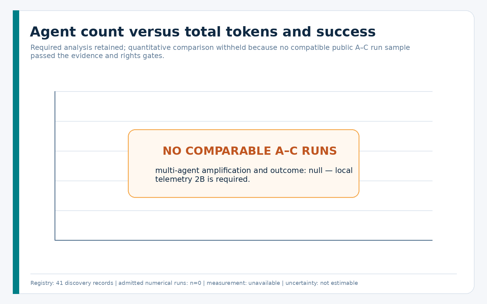

## 6. Data Licensing and Privacy

A public URL is not a redistribution license. A code or schema license does not
license prompts, model outputs, operator telemetry, captured web pages, issue
text, screenshots, network traces, or third-party repositories.

Every dataset record separately tracks:

- software/schema license;
- telemetry or dataset rights;
- raw acquisition status;
- raw redistribution status;
- commercial-use signal;
- attribution requirement;
- permitted derived-statistics status;
- personal-data, secret, and reasoning-content risk;
- human-review requirement.

Raw prompts, private chats, credentials, cookies, authorization headers,
storage state, browser tokens, private repository text, personal addresses, and
hidden reasoning are outside the public corpus. Hidden reasoning **counts** may
be telemetry; hidden reasoning **text** is neither required nor approved.

The public-safe unit is an allowlisted record containing identifiers, hashes,
counts, categorical features, tool types, durations, outcomes, missingness, and
provenance. The [license and publication review](../sources/LICENSE_AND_PUBLICATION_REVIEW.md)
documents source-specific restrictions.

## 7. Canonical Telemetry Schema

Four strict Draft 2020-12 schemas define the research corpus:

| Schema | Unit | Key purpose |
| --- | --- | --- |
| `agent_run_record` | one task attempt/run | model/framework/task identity, cumulative usage, tools, outcome, costs, chain/censoring, quality |
| `agent_request_record` | one model request | request sequence, provider usage, cache/reasoning details, tools, latency, request cost |
| `task_record` | one dataset task | SE/MATH/PHY and operational taxonomy, benchmark/version, verifier/success criterion |
| `source_provenance` | one source artifact | canonical locator, revision/hash, rights, transformations, privacy review |

All schema fields are required at the record level, while genuinely missing
measurements use `null`, appear in `missing_fields`, and carry measurement method
`unknown`. Observed fields are labeled `measured`, `provider_reported`,
`framework_reported`, `reconstructed`, or `estimated`.

### 7.1 Numerical admission gate

`included_in_numerical_priors` is independent of quality class. Admission
requires all of:

- quality A, B, or C;
- explicit inclusion flag;
- no censoring;
- completed privacy review;
- permission for derived statistics;
- known measurement confidence;
- all ten persisted boolean quality components, a recomputed score, and a
  score consistent with its A/B/C class;
- explicit numerical permission in the dataset registry;
- exact timestamped model/provider/version, framework/version, and product
  surface identity;
- observed prompt and total-token values with known accounting scopes;
- a completed outcome, success criterion, and objective verifier evidence;
- compatible model/framework/task/verifier/accounting/price stratum.

D/E records cannot enter numerical priors. A–C records can still be withheld for
rights, missingness, leakage, or incompatibility.

### 7.2 Referential and aggregate checks

The validator enforces stable source/dataset IDs, composite `(dataset_id,
task_id)` task identity, unique run/request identity, task/run/request links,
request sequence uniqueness, embedded provenance agreement, complete-request
aggregate sums, tool-call counts, contiguous attempt-chain order, one final
accepted run in the last attempt, dataset numerical permission, and censoring
semantics.

## 8. Task Taxonomy

The taxonomy aligns with existing SmartRouter SE, MATH, and PHY scales while
adding operational features:

- single-turn vs agentic;
- no file, single file, or multi-file;
- no repository, repository-local, or cross-repository;
- read-only, write, or mixed;
- tool-free, light, or tool-heavy;
- deterministic, partial, subjective, absent, or unknown verifier;
- short, medium, or long horizon;
- clear, partially ambiguous, ambiguous, or unknown requirements;
- fresh, continued, or long-continuing context;
- low, moderate, high-impact, or unknown risk;
- research, implementation, analysis, verification, mixed, or unknown work.

These are preregistered candidate predictors. The corpus does not rank their
importance.

## 9. Software-Engineering Agent Costs

Software-engineering benchmarks are the strongest public domain for objective
verification, but they do not create automatic cost comparability. A valid
stratum must hold or record:

- task split and benchmark version;
- repository/base revision and environment image;
- model ID/version and reasoning effort;
- framework/prompt/tool/condenser versions;
- token and wall-time budgets;
- evaluator version and success criterion;
- attempt/retry/escalation policy;
- complete successful, failed, censored, and infrastructure-error coverage;
- product surface, accounting scope, and measurement method profile;
- historical currency, price-table ID/date, and cost scope.

Repository size can be a candidate input predictor, yet “repository size” itself
needs a definition: bytes, files, language-aware source tokens, retrieved subset,
or serialized context. Files present on disk are not necessarily sent to the
model.

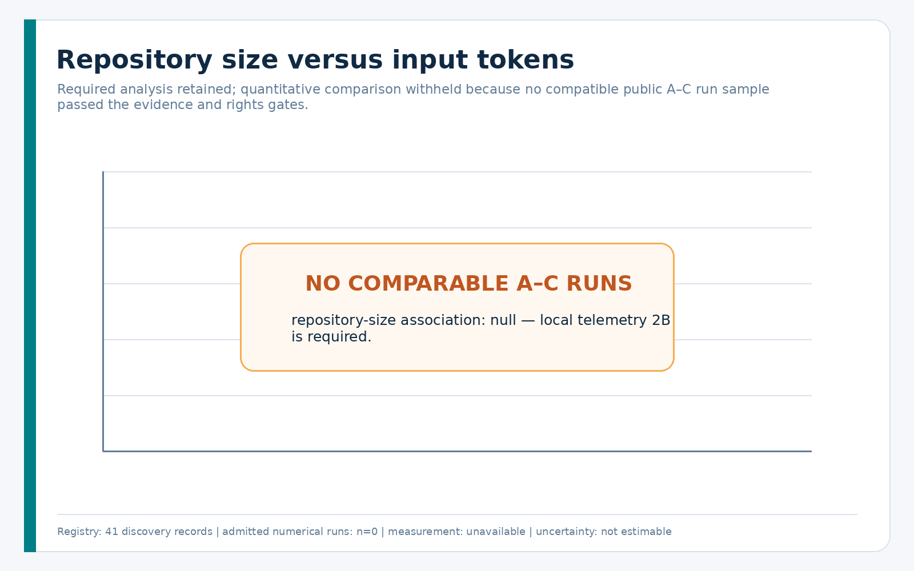

No compatible A–C public runs passed the gate, so the panel is intentionally
empty.

## 10. Tool and Context Amplification

Tools affect token economics in at least four ways:

1. a model generates tool arguments;
2. a tool result is inserted into context;
3. later requests re-send all or part of that result;
4. errors or invalid calls trigger repair loops.

Tool-call count is not tool-output size. Parallel tools can reduce elapsed time
while increasing summed resource use. An accepted analysis therefore needs tool
type, payload bytes/tokens, start/end, success, invalid/repeated flags, later
request attribution, and whether results were summarized or compacted.

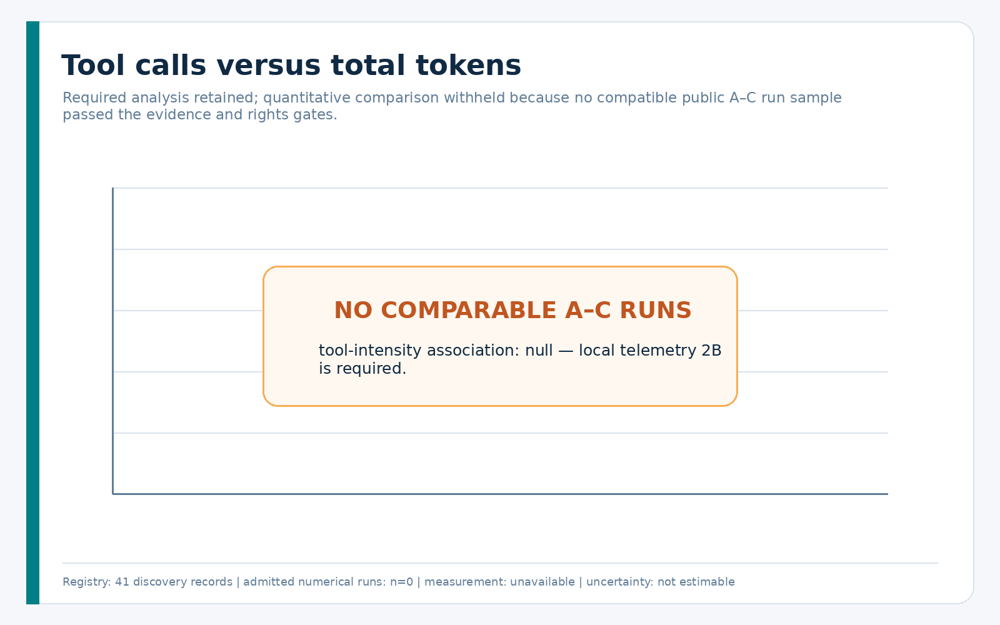

Session continuation similarly amplifies input because previous messages may be
re-fed on later runs. Official Agents SDK documentation confirms the mechanism,
but no inspected surface directly partitions later input into new user text,
history, tool output, retrieved files, or compaction summary. Mission 2B must
collect component-aware counts.

## 11. Caching and Repeated Context

Caching changes billing and often latency, not the logical input length. A cache
hit must therefore report at least:

- total input tokens;
- cached input tokens;
- cache-write tokens when supported;
- non-cached input if provider-reported or explicitly reconstructed;
- model/version, service tier, cache policy, and price date.

Cached tokens can still count toward token rate limits. A cache ratio is valid
only when numerator and denominator share one definition. It must never be used
to infer ChatGPT/Codex subscription credit from API prices.

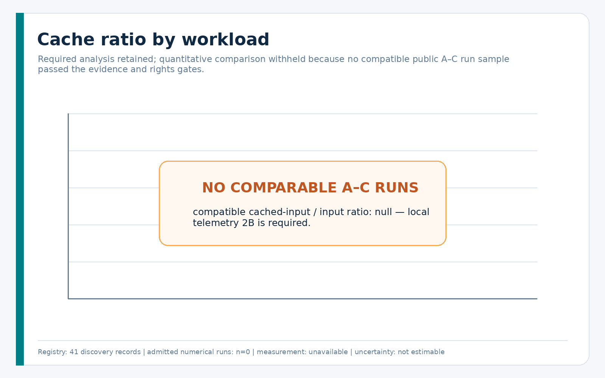

The public corpus supports the accounting mechanism, not a workload-specific
ratio distribution.

## 12. Failure, Retry, and Escalation Economics

Success-only cost summaries have survivorship bias. If a cheap first model fails
and a stronger model finishes the task, the accepted result consumed both
attempts plus transition, verification, and review.

For a route chain with attempts `i = 1..k`, define:

`C_accept = Σ(model_api_i + tool_i + verification_i + human_review_i + failure_penalty_i)`

only when the chain is complete, uses one compatible currency/price basis, and
ends in exactly one accepted result on the final contiguous attempt. Every
attempt must carry run-scoped normalized cost and the same non-null currency,
price-table ID, and price-table date. Chain-scoped totals are never added once
per attempt. Missing cost components make the value `null`; they are not zero.

Budget exhaustion, cancellation, context overflow, infrastructure failure, and
ordinary verifier failure are different outcomes. Budget-exhausted/interrupted
runs are censored and excluded from ordinary success/failure rates. Eligible
censored runs require a separate explicit censoring-analysis flag and are
summarized by exposure and reason. A survival analysis is fitted only when
censoring time/budget and comparable task-cluster support are available.

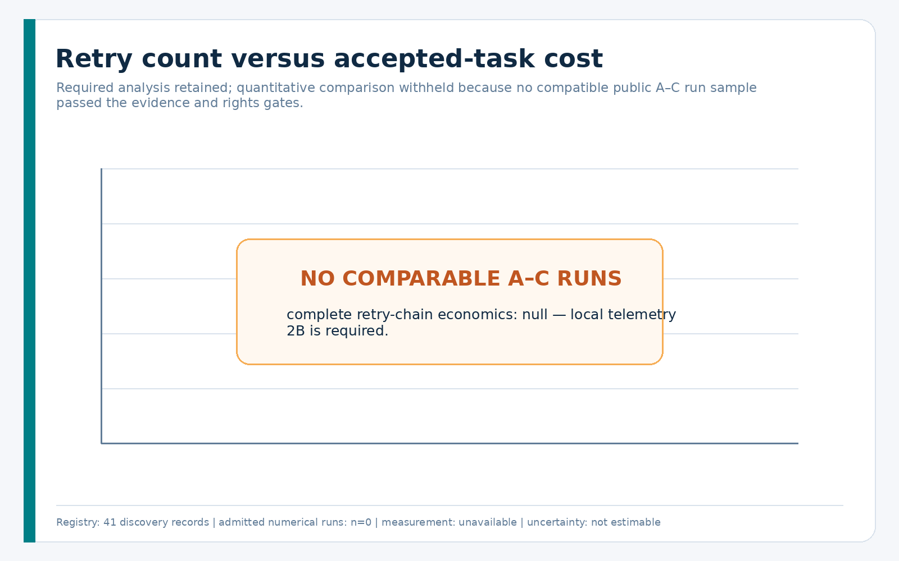

## 13. Cost per Accepted Task

Let a lower-cost first route have direct expected cost `C_l`, success probability
`p_l`, and expected downstream cost `E_l` conditional on non-acceptance. Let a
stronger direct route have expected accepted-chain cost `C_s`. The lower-cost
route is economically preferable only when:

`C_l + (1 - p_l) × E_l < C_s`

after capability, safety, verifier, budget, availability, and approval gates are
satisfied. This is an accounting identity, not an estimated crossover. `E_l`
must include retries, escalation, tool use, extra verification, human review,
and a policy-defined failure penalty.

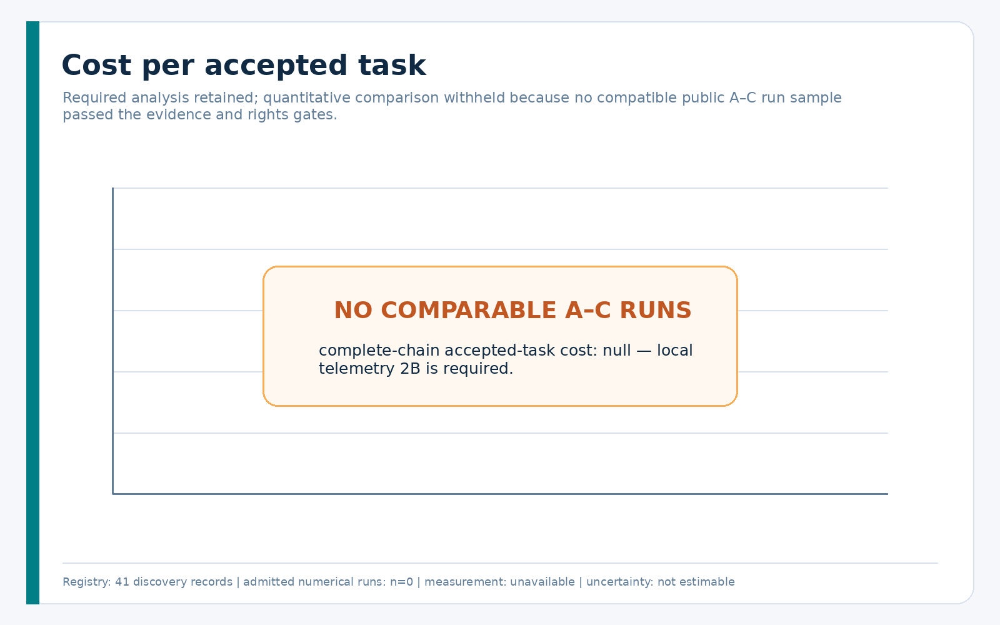

The corpus contains no complete price-date-correct accepted route chain eligible
for a numerical prior.

## 14. Public-Data Statistical Findings

### 14.1 What could be computed

The registry and discovery corpus support:

- source/dataset counts and historical coverage;
- field-availability and missingness maps;
- rights, privacy, and quality classifications;
- bounded structural inspection of parser fixtures;
- explicit zero admitted numerical-prior runs.

### 14.2 What was withheld

The required token, success, accepted-cost, cache, tool, repository-size, retry,
and agent-count charts exist as reproducible **no-data panels**. Filling them
with incompatible aggregates would be less informative and more misleading than
showing `null`.

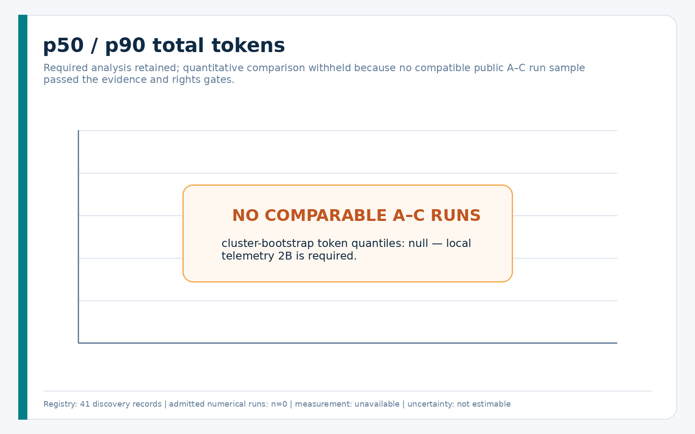

### 14.3 Robust methods for future compatible data

For each compatible stratum, the analysis code computes p10, p25, p50, p75,
p90 and outcome-conditioned distributions. Percentile intervals and the primary
success interval use 2,000 bootstrap resamples clustered by `(dataset_id,
task_id)`. Success is first averaged within each task and then across equally
weighted tasks, so repeated trajectories cannot manufacture precision. It never
averages across incompatible datasets. Intervals require at least five
independent task clusters; `n < 20` is flagged. Censored runs have a separate
exposure/reason summary rather than an ordinary outcome.

Lookup baselines use held-out task and source groups. Regularized baselines need
at least `max(100, 10 × encoded feature width)` observations. The probability
baseline is correctly labeled a ridge linear-probability baseline, not logistic
regression. The one-split tree contains an explicit missing-value branch. No
model is fitted when support is inadequate.

## 15. Answers to the Research Questions

| Question | 2A answer |
| --- | --- |
| strongest token predictors | unanswerable; candidate features are preregistered, not ranked |
| strongest failure/retry predictors | unanswerable without complete comparable failed/censored chains |
| when a cheaper model becomes more expensive | when downstream failure-chain cost exceeds the initial saving; no threshold estimated |
| when Spark is efficient | no controlled same-task accepted-cost evidence; unknown |
| when Luna minimizes accepted cost | no complete Luna chain population or verified immutable identity; unknown |
| when Terra beats Luna economically | no matched comparison; unknown |
| which risk/ambiguity routes immediately to Sol | empirical threshold unknown; safety and human policy gates precede price |
| token growth from tools | mechanism supported, share unmeasured |
| token growth from repeated history | mechanism supported, share unmeasured |
| caching effect | can lower API-billed input cost without reducing logical input processed |
| agent-count effect | qualitative coordination amplification; no causal token/pass-rate curve |
| unusable historical datasets | most inspected artifacts cannot supply numerical routing priors in current form |
| required local fields | exact identity, component usage, chains, context/compaction, tools, outcome, price, review |

Model-specific rules are not inferred from aliases, version numbers, a visible
picker, or current prices.

## 16. Missing Evidence

The strongest missing evidence is not “more trajectories” in the abstract. It
is a **representative, rights-cleared, outcome-linked, request-level population**
with complete failures and route chains.

Key gaps:

- early agent eras lack comparable provider usage;
- web agents usually lack usage fields and carry raw-content privacy risks;
- software-agent releases mix formats, versions, prompts, budgets, and rights;
- public leaderboards omit abandoned experiments and favor competitive systems;
- training corpora filter for validity/reward/success and distort failure rates;
- reasoning, cache, and tool-output partitions are uncommon;
- current context occupancy and compaction burden are rarely measured;
- price-date and subscription/API distinctions are usually absent;
- multi-agent examples lack matched agent-count experiments;
- public data do not represent SmartRouter’s own task distribution.

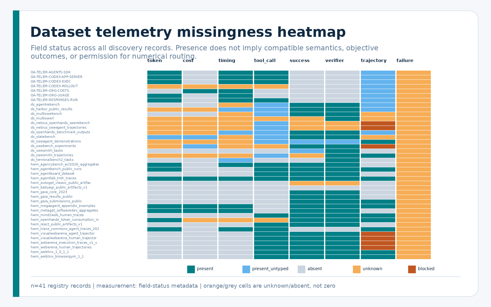

## 17. Local Telemetry Requirements

Mission 2B should collect privacy-minimized records in priority order.

### P0 — Identity and terminal outcome

- immutable task, benchmark/version, repository/base revision;
- route, attempt-chain, ordered attempt, retry/escalation identifiers;
- requested alias and service-confirmed model/version;
- product surface, framework/version, reasoning effort, agent count;
- deterministic verifier/result, partial score, censoring, final acceptance;
- human-review minutes.

### P0 — Per-request usage and timing

- request ID/sequence/status and start/end monotonic time;
- provider input, cache read/write, reasoning, output, total fields;
- request failure/rate-limit wait/retryability;
- reported/reconstructed cost, currency, scope, price-table ID/date.

### P1 — Component-aware amplification

- allowlisted counts for system/developer/user additions;
- re-sent history;
- tool results by type;
- repository/file excerpts;
- verifier messages;
- subagent/handoff context;
- compaction summaries.

### P1 — Context, tools, and agents

- last vs cumulative usage;
- measured current/peak occupancy where exposed;
- explicit compaction event and post-compaction state;
- tool type/duration/outcome/repeats/invalid calls/result size;
- per-agent usage and handoff/concurrency graph.

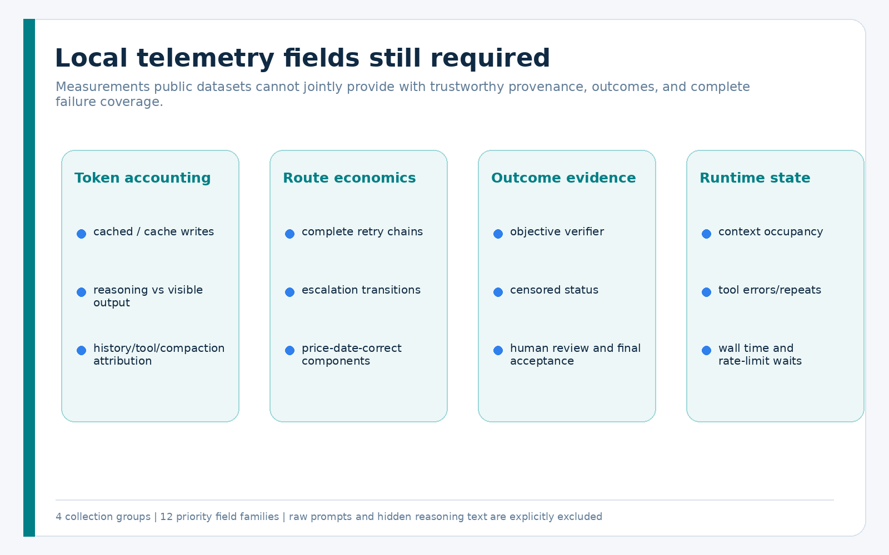

Raw prompt text, hidden reasoning, credentials, and private tool output are not
needed for these analyses.

## 18. Proposed SmartRouter Prediction Features

Candidate feature groups are:

- **capability:** SE/MATH/PHY level and domain/subdomain;
- **scope:** interaction, file, repository, and mutation mode;
- **execution:** tool profile, horizon, agent count, context state;
- **requirements:** clarity/ambiguity, task size, repository size;
- **evidence:** verifier type, success criterion, benchmark/version;
- **risk:** impact level and human-approval requirement;
- **runtime:** current model availability, token/time budgets, session state;
- **historical telemetry:** only compatible, recent, leakage-controlled local
  strata.

Candidate targets are p50 input tokens, p90 total tokens, probability of
completed acceptance, probability of escalation, compaction/retry counts,
wall time, and complete accepted-task cost. Predictor strength remains unknown
until 2B.

## 19. Proposed Routing Objective

For task features `x` and candidate model route `m`, future SmartRouter research
may minimize:

`E[accepted_task_cost | x, m]`

subject to:

- minimum calibrated acceptance probability;
- capability ceiling;
- task-risk and safety constraints;
- appropriate verifier availability;
- token and wall-time budgets;
- current model/product availability;
- human-approval boundaries.

Price is a term in the objective, never a substitute for capability or safety.
Low-confidence, unsupported, or out-of-distribution tasks fail closed to a
conservative supported route or human decision.

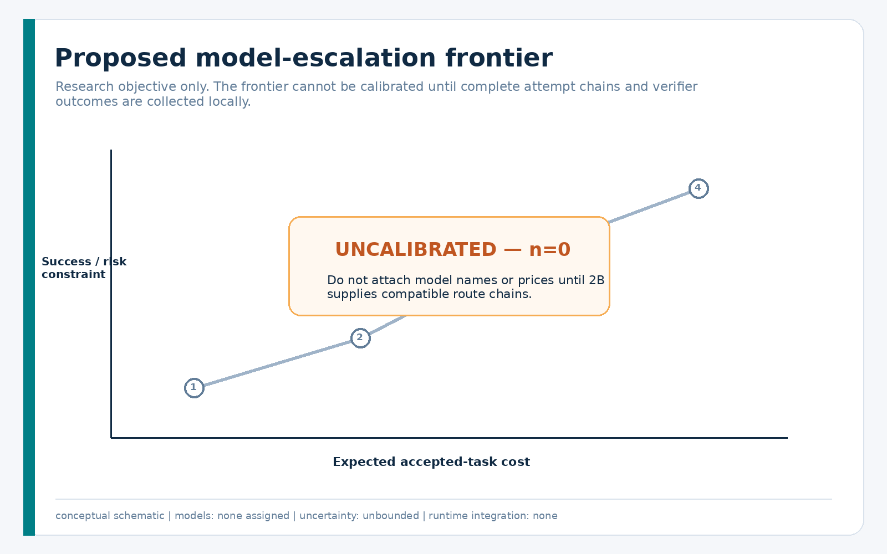

The frontier is explicitly schematic. It contains no empirical model points.

## 20. Baseline Prediction Models

The research package implements small, interpretable baselines:

1. median lookup by compatible stratum;
2. p90 quantile lookup;
3. L2-regularized log-target regression for token/cost targets;
4. L2-regularized linear-probability baseline for success/escalation;
5. a one-split descriptive tree with an explicit missing branch.

Targets remain untrained when support is insufficient. Lookup calibration is
reported separately by stratum and held-out task/source group. A regularized or
tree training diagnostic is not calibration and is marked publication-ineligible
until nested task-group and source-group evaluation exists. No estimator is
imported by production runtime.

## 21. Limitations and Non-Claims

- This is not a universal dataset of all agents or all historical runs.
- Absence of a public field does not prove an author never measured it privately.
- No public A–C numerical run population passed every 2A gate.
- Empty charts are deliberate and must not be replaced by incompatible totals.
- Aggregate paper examples are not per-request telemetry.
- Human demonstrations are not model token usage.
- Visible reasoning text is not a provider reasoning-token count.
- Current context occupancy is not cumulative session usage.
- Context-window capacity is not occupancy.
- API prices do not define subscription quota use.
- Current prices are not silently applied as historical billed amounts.
- Budget-exhausted runs are censored, not ordinary failures.
- Success-only cost is not accepted-task cost.
- Multi-agent examples do not establish a causal agent-count effect.
- No Spark/Luna/Terra/Sol rule is established.
- No production routing behavior changed.

## 22. Source and Dataset Registry

The canonical human-readable registries are:

- [Source Registry](../sources/SOURCE_REGISTRY.md)
- [Dataset Registry](../sources/DATASET_REGISTRY.md)
- [Historical Coverage and Missing-Data Map](../sources/COVERAGE_AND_MISSING_DATA.md)
- [Local Codex Telemetry Surfaces](../sources/LOCAL_CODEX_TELEMETRY_SURFACES.md)

Machine-readable equivalents, schemas, manifests, statistical outputs, chart
metadata, and the research-only knowledge pack accompany this handbook.

## 23. Reproducibility Checklist

1. Rebuild source/dataset registries from isolated research packets.
2. Rebuild the coverage and missing-data maps.
3. Acquire only the bounded, license-reviewed parser fixture into temporary
   storage; keep raw text outside Git.
4. Run the allowlist transformation and manifests.
5. Validate every JSON/JSONL record and schema reference.
6. Run structural, missingness, rights, censoring, referential, and aggregate
   tests.
7. Compute stratified statistics and baselines; expect `null`/untrained results
   when the numerical gate is empty.
8. Regenerate PNG/SVG charts and metadata.
9. Build HTML/PDF and render every PDF page for visual review.
10. Run citation, privacy, license, and adversarial audits before publication.

## Conclusion

Public agent evidence is sufficient to design a trustworthy telemetry system,
but not to publish universal model token budgets or SmartRouter model-specific
cost rules. The correct 2A artifact is therefore a conservative corpus with
strong provenance, explicit missingness, bounded acquisition, reproducible
methods, and an empty numerical-prior gate.

SmartRouter is ready for a separately authorized local telemetry mission 2B.
That mission should measure matched, privacy-minimized, complete route chains;
only then can model selection optimize accepted-task cost without sacrificing
capability, safety, or verification.
